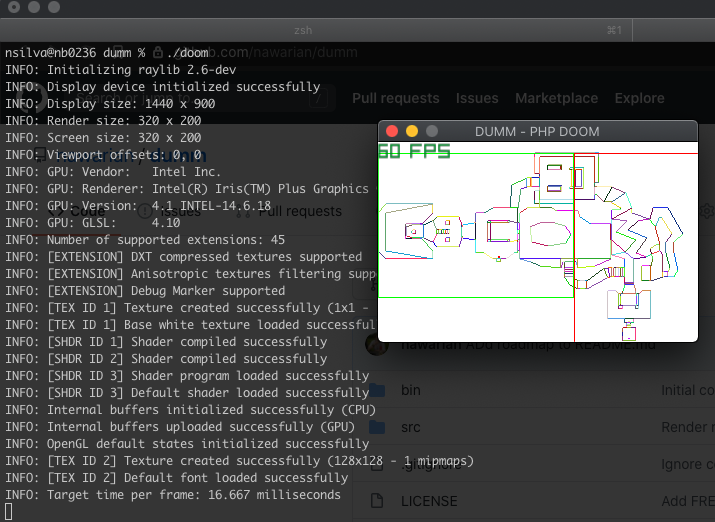

DUMM
---

A php port of the 1993's DOOM based on [Amro Ibrahim's DIYDoom](https://github.com/amroibrahim/DIYDoom).

# Requirements

- PHP 7.4
- [Joseph Montanez's raylib extension](https://github.com/joseph-montanez/raylib-php)
- [Basic knowledge on how to use raylib](https://thephp.website/en/issue/games-with-php/)

# Running the project

Make sure you've placed `DOOM1.wad` and `raylib.so` in the root path.

```
$ ./doom
```

# Current State


The above screen has only one color, because all columns are rendered
using the same color. Due to an error on the BSP Traversal. But the fact
we see a single color means that we're filling the entire screen, which is
what should happen :D

# Roadmap

- [x] Read WAD file
- [x] Render automap
- [x] Traverse BSP tree
- [x] Render scene lines
- [x] Clip solid walls
- [ ] Render scene rectangles
- [ ] Add perspective
- [ ] Draw floor and ceiling
- [ ] Draw textures
- [ ] Move around

